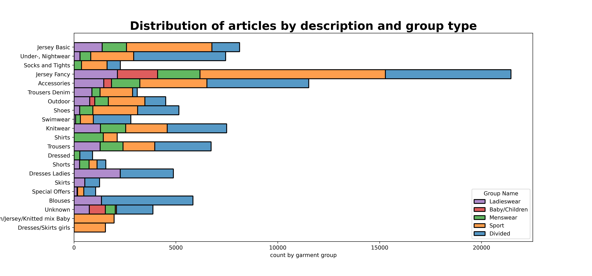
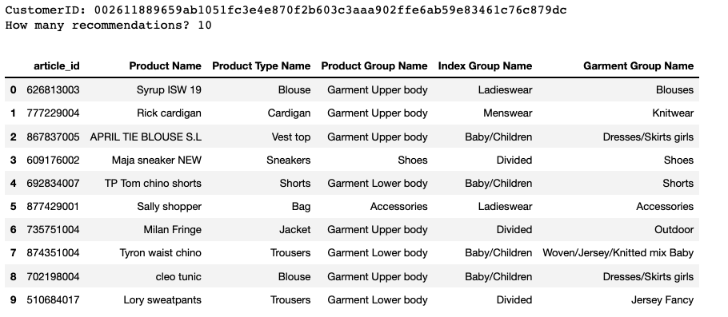
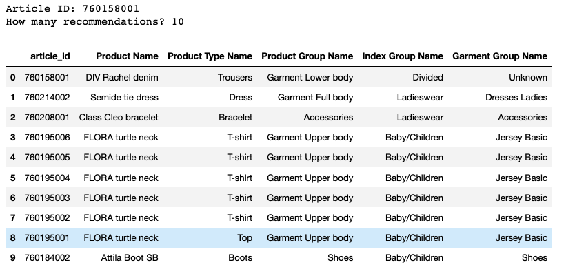
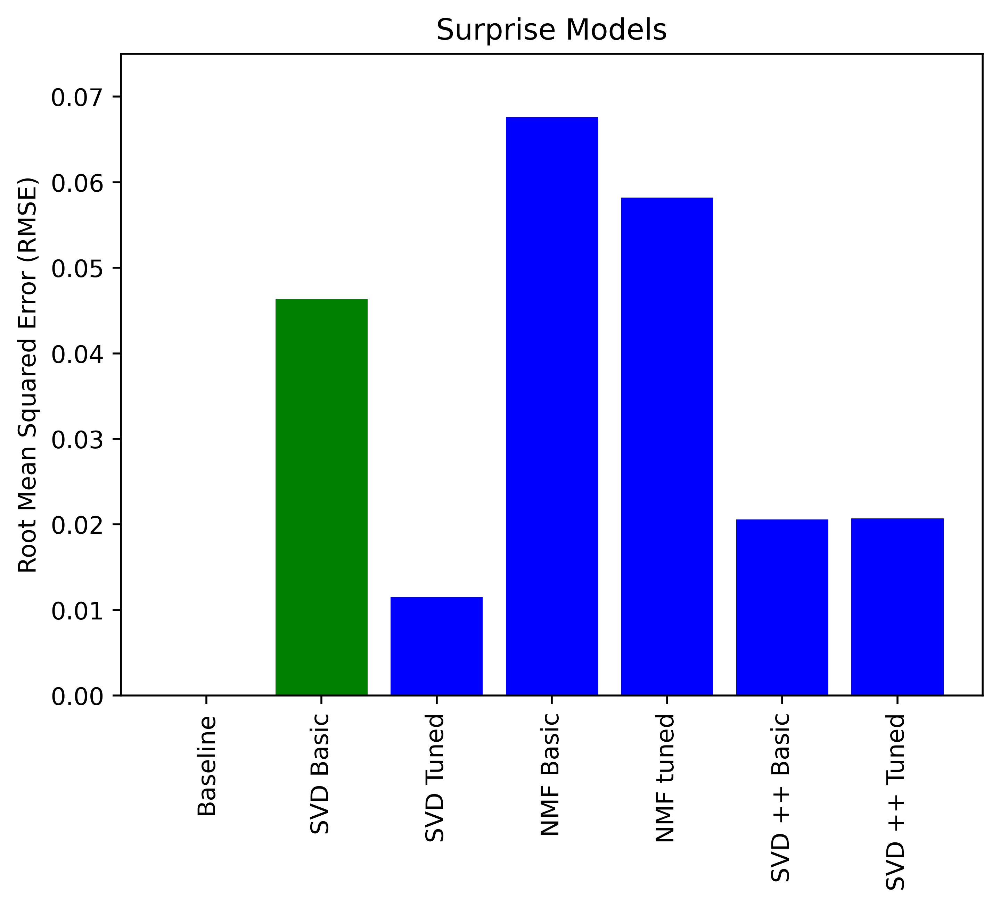
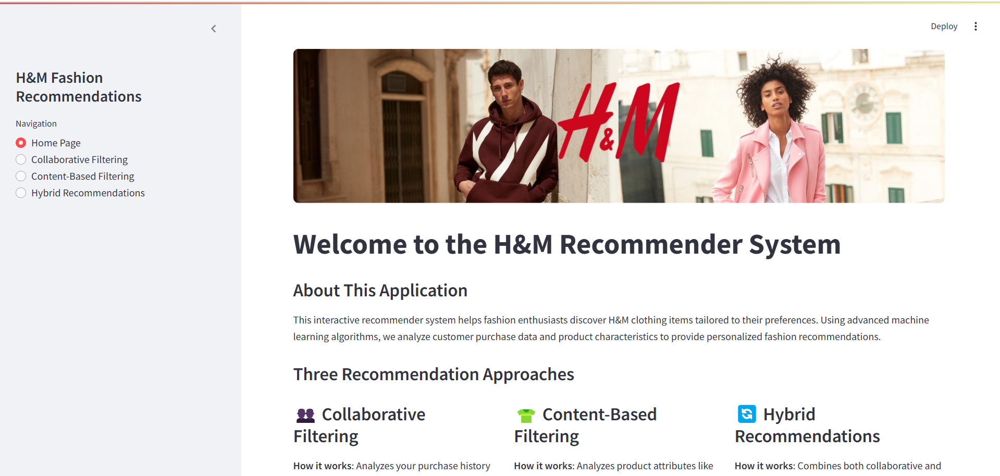
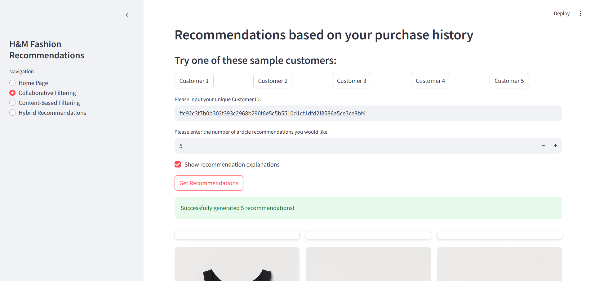
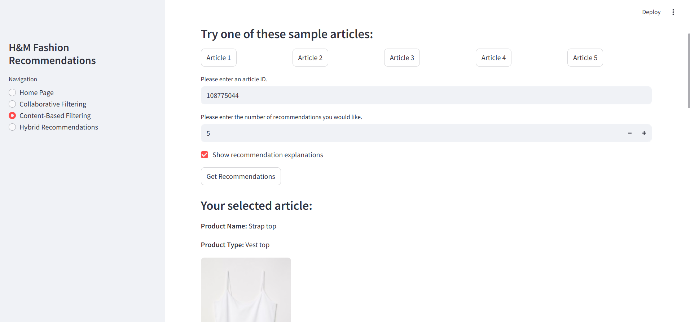
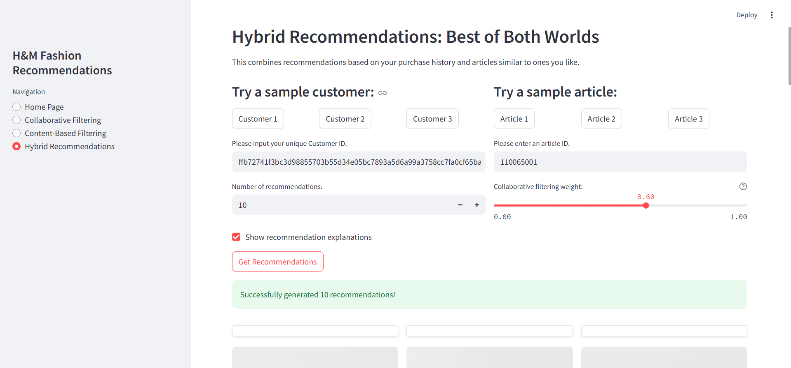
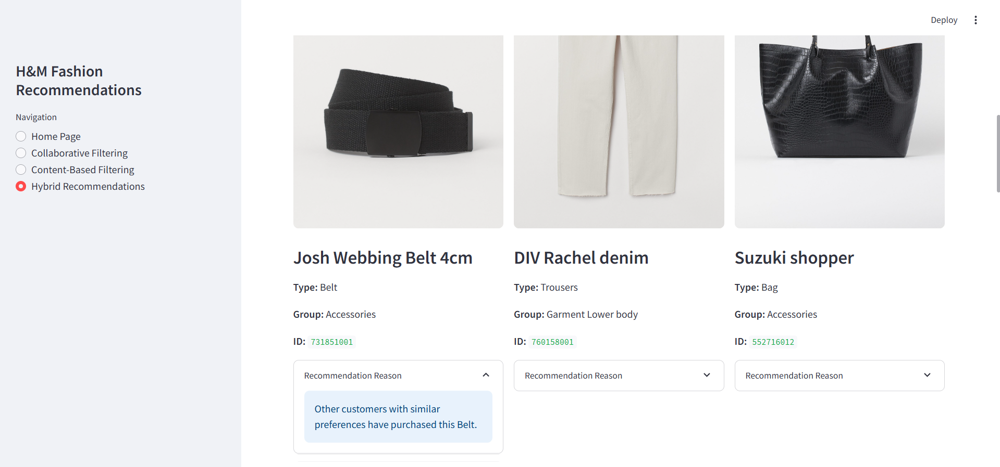

# 👗 H&M Personalized Fashion Recommendation System

> A multi-algorithm fashion recommender system for new and existing H&M customers built with Streamlit

---

## 🧠 Overview

This project leverages a hybrid recommendation approach to personalize fashion recommendations using the H&M dataset. It includes three recommendation strategies:
- **Collaborative Filtering** for existing users
- **Content-Based Filtering** for article similarity
- **Hybrid Approach** combining both methods in a Streamlit application

You can explore the live demo locally by running `streamlit run app.py`.

---

## 🛒 About H&M

Hennes & Mauritz AB (H&M) is a global leader in fashion, providing clothing and accessories to millions worldwide. As online shopping rises, so does the importance of personalized recommendations to enhance customer satisfaction and boost online conversions.

---

## 🎯 Objective

To build a recommender system that:
- Improves online user engagement
- Helps both new and returning customers
- Combines customer transaction data and article metadata for more accurate and diverse results

---

## 📦 Data Source

Data was obtained from the [H&M Personalized Fashion Recommendations competition on Kaggle](https://www.kaggle.com/competitions/h-and-m-personalized-fashion-recommendations).

It includes:
- Customer transaction history
- Metadata for each article (product type, color, group, etc.)
- Images of clothing articles

---

## 🔍 Methods Used

### 👥 Collaborative Filtering (CF)
- Based on customer purchase patterns
- Uses Surprise's SVD for matrix factorization
- Suitable for users with historical data

For implementation details, refer to the [Collaborative Filtering Notebook](./H&M-CollaborativeFilteringModeling.ipynb).

---

### 👕 Content-Based Filtering (CB)
- Recommends items similar to a given article
- Uses cosine similarity on selected metadata features

For implementation details, refer to the [Content-Based Filtering Notebook](./H&M-ContentBasedFilteringModeling.ipynb).

---

### 🔄 Hybrid Approach
A novel hybrid model was implemented in the Streamlit app that:
- Takes both user ID and an article ID
- Allows adjustable weighting between CF and CB
- Merges results while avoiding duplicates
- Returns explanations for each recommendation

---

### Models explored
Various models where explored in building the recommendation systems, their performance comparison are as follows

## 💻 Streamlit Application

The entire system is deployed through a Streamlit web app offering an intuitive interface to explore the recommendations interactively.

### 🏠 Home Page

### 👥 Collaborative Filtering Page

### 👕 Content-Based Filtering Page

### 🔄 Hybrid Recommendation Page

### Sample Output

NOTE : To run the project paste the complete dataset from kaggle in the Data folder
